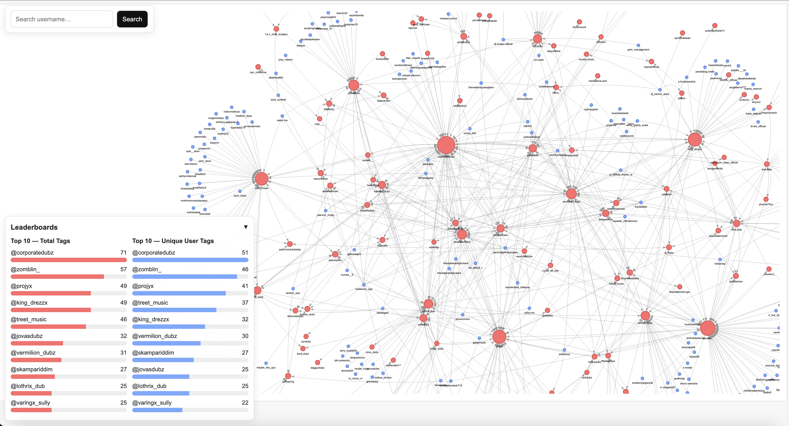

# Instagram Comment Tag Analyzer



This tool shows **which users were tagged the most** in an Instagram post and lets you explore the **relationship graph** between commenters and the people they tagged.

It works entirely offline — just copy/paste the comments from Instagram into a text file and generate your own interactive graph.

---

## What It Does
- Parses raw Instagram comments
- Counts how many times each user was tagged
- Counts how many **unique** people tagged each user
- Builds an interactive graph showing:
  - Who tagged whom
  - How users are connected
  - Clickable nodes with info about a user
  - A search bar to quickly find anyone
  - Leaderboards for top-tagged users

---

## How to Use
1. On **desktop**, open the Instagram post and scroll until comments stop loading.
2. Press **CMD/CTRL + A** then **CMD/CTRL + C** to copy the whole page of comments.
3. Paste into `comments.txt`, then delete any extra text that got copied above or below the comments (post caption, “load more” buttons, footer, etc.) so it matches the example format.
4. Run:
   ```bash
   python3 graph_tags_interactive.py
   ```
5. Open `interactive_graph.html` in your browser.

---

## Files
- `comments.txt` — your pasted Instagram comments
- `graph_tags_interactive.py` — generates the graph
- `interactive_graph.html` — output graph
- `post.png` — screenshot of the rules (optional)

---

## Requirements
```
pip install networkx pyvis
```

---

## Notes
- Comments with no @ tags are ignored.
- The tool only uses the raw comment text — no login or API needed.
- Works for any Instagram post as long as comments follow the same structure.

---

## Example Data
The included `comments.txt` contains a real example taken from the original Instagram post (before it was deleted). 

The file `post.png` is a screenshot of that post and its rules.

You can delete or replace `comments.txt` with your own copied comments to analyze any other Instagram post.
