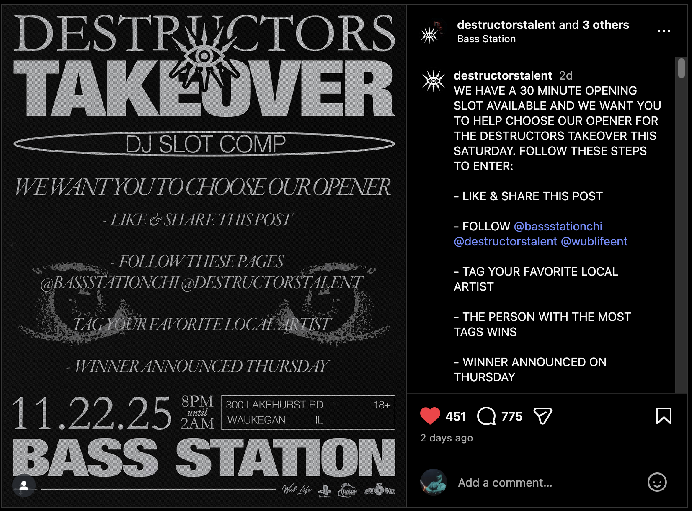

# Instagram Tag Contest Analyzer

## 📌 Overview


I entered an Instagram contest ([this post on Instagram](https://www.instagram.com/p/DRNG46vASoz/)) where the winner was supposed to get the **opening DJ slot for a show**.  
The rules were simple on paper: people comment on the contest post and **tag their favorite local artist**, and the artist with the most tags wins.  

In reality, three artists — **Vesum**, **Kakashi**, and **Jovas** — were announced as winning the slot (3 artists sharing what was presented as one opportunity), even though they did **not** receive the most tags on the post. This project exists to put hard numbers behind what a lot of us already suspected: the contest result did not actually follow the “most tags wins” rule.

---

## 🔍 What This Project Does

### ✔ Parse the copied comments from Instagram  
Comments are structured like:

```
username's profile picture
username
 <time since comment> (2d, 3h, 5m, etc.)
@artist1 @artist2
```

The script reads this format and extracts:
- the commenter’s username  
- the tags inside each comment

---

## 🏆 Two Types of Leaderboards

### **1. Raw Tag Count (WITH duplicates)**  
Counts *every* time an `@tag` appears.

Example:
- If someone tags `@dj_example` 10 times → counts as 10  
- If a person spams the same artist → all counted  
- This shows total hype + spam + activity

This is how Instagram **looks** when scrolling the comments.

---

### **2. Unique Voter Count (WITHOUT duplicates)**  
Counts **unique commenters** per artist.

Example:
- If someone tags `@basslord9000` 20 times → counts as **1 vote**
- If someone tags `@basslord9000` again in a different comment → still **1 vote**
- Shows REAL support, not spam

This is the **fairest measure** of who the crowd actually supports.

---

## 📁 Files

- `comments.txt` — raw IG comments (copied & pasted from the post)
- `analyze.py` — main script to parse and analyze
- `README.md` — this file

---

## ▶️ How to Run

1. On desktop, open the Instagram contest post.
2. Scroll through the comments **all the way to the bottom** so every comment loads.
3. Press **Ctrl + A** (Windows) or **Cmd + A** (Mac) to select the entire page.
4. Copy and paste everything into `comments.txt` (overwrite any previous content).
5. Run:

```
python3 analyze.py
```

3. The script will print:
- Top 10 artists by **total tag mentions** (with duplicates)
- Top 10 artists by **unique voters** (no duplicates)
- A summary of total tags and unique voters specifically for:
  - **@vesummusic**
  - **@kakashi_dubz**
  - **@jovasdubz**

---

## 🎯 Why I Built This

I wanted to understand:
- who was actually winning the contest according to the stated "most tags wins" rule,
- how the announced winners compared to other artists in terms of total tags,
- how many **unique people** actually tagged each artist (real support),
- and to document that Vesum, Kakashi, and Jovas did not top the leaderboard, despite being given the slot.

Instagram only shows the mess — this script finds the truth underneath it.
